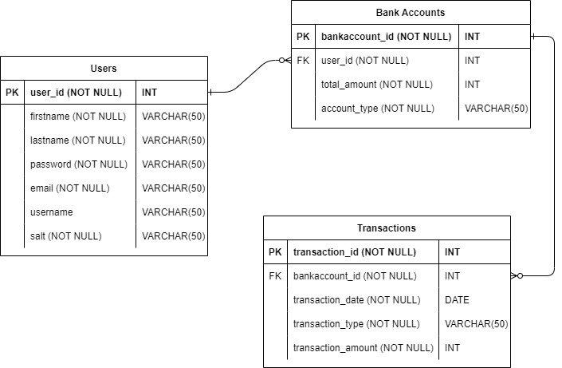

# NBOBanking-Backend

Link To Frontend NBOBanking Service: https://github.com/bkwrdbailey/NBOBanking-Frontend

## Tech Stack:
- Java 17
- Hibernate/JPA
- Spring boot
- AWS Services
  * Relational Database Service
  * Simple Email Service
  * Elastic Container Registry

## Features:
- User can create a bank account
- User can deposit money
- User can withdraw money
- User can transfer money between accounts (ex. Checking to Savings)
- User will receive an email each time they deposit, withdraw, or transfer

## Entity Relationship Diagram

